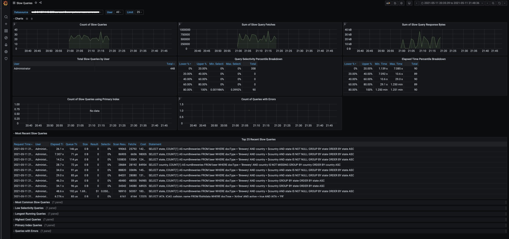
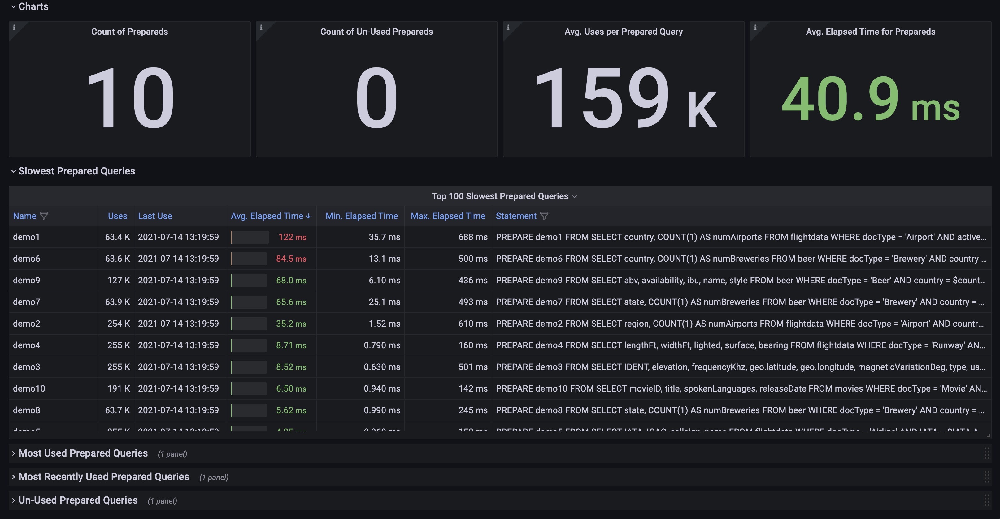

# Couchbase Query Grafana Dashboards

Collection of Grafana Dashboards for the Couchbase Query Service.  

The dashboards leverage the Grafana plugin [JSON API Datasource](https://marcus.se.net/grafana-json-datasource/) from Marcus Olsson by calling the [Query Service REST API](https://docs.couchbase.com/server/current/n1ql/n1ql-rest-api/index.html)

## Data Source Setup

Once the JSON API is [installed](https://marcus.se.net/grafana-json-datasource/installation), a datasource will need to be configured for _each_ of the Couchbase Nodes running the Query Service.  

1.  In Grafana, navigate to `Data Sources` and select `Add data source`
2.  From the list of data-sources select `JSON API`
3.  Enter a name for the datasource, this can be whatever you prefer.  A suggestion for multiple clusters might be `Name of Cluster - node hostname`
4.  In the `URL` field enter `http://HOSTNAME:8093`
-   If you are using SSL, enter `https://HOSTNAME:18093`
-   Replace `HOSTNAME` with the configured hostname or IP address
5.  In the "Auth" section check `Basic Auth` and `With Credentials`
-   If using SSL, check `Skip TLS Verify`
6.  Enter an [RBAC](https://docs.couchbase.com/server/current/rest-api/rbac.html) Username and Password.  Note that the RBAC user must have access to `Query System Catalogs`
7.  Select the `Save & Test` button, note that you will get an error that says `JSON API: Not Found`, this can be ignored as the datasource is saved.  This is due to no endpoints being configured as they are configured in the dashboards themselves.

Repeat this process for _each_ query node that you wish to configure.   By default each of the dashboards is setup with variable for the `$datasource` that will automatically show a list of each datasource configured using the [JSON API Datasource](https://marcus.se.net/grafana-json-datasource/) plugin.  

---

## Dashboards

The dashboards can be imported into Grafana, by navigating to `Manage Dashboards` and selecting the `Import` option.  The dashboard json can be copied and pasted directly into the UI or uploaded.  

---

### [Slow Queries Dashboard](dashboards/slow-queries-dashboard.json)

The slow queries dashboard will query and display information from the [`system:completed_requests`](https://docs.couchbase.com/server/current/manage/monitor/monitoring-n1ql-query.html#sys-completed-req) keyspace.    Many of these queries are adapted from the [Couchbase Connect Online: Identifying and Tuning Slow Queries Presentation](https://www.youtube.com/watch?v=VlvL6jYCENw&t=1s).   While the  [`system:completed_requests`](https://docs.couchbase.com/server/current/manage/monitor/monitoring-n1ql-query.html#sys-completed-req) keyspace is global, the N1QL queries performed by the dashboard are limited in scope to a single query node for minimal impact and performance.

##### Filters

-   Datasource
-   User _(default: All)_
-   Limit _(default: 25)_

##### Charts/Stats

-   Count of Slow Queries
-   Sum of Slow Query Fetches
-   Sum of Slow Query Response Bytes
-   Total Queries by User
-   Query Selectivity Percentile Breakdown
-   Elapsed Time Percentile Breakdown
-   Count of Slow Queries using Primary Index
-   Count of Slow Queries with Errors

##### Tables

-   Recent Slow Queries
-   Most Common Slow Queries
-   Low Selectivity Queries
-   Longest Running Queries
-   Highest Cost Queries
-   Primary Index Queries
-   Queries with Errors

---

### [Prepared Statements Dashboard](dashboards/prepared-statements-dashboard.json)

The [prepared statements](https://docs.couchbase.com/java-sdk/current/concept-docs/n1ql-query.html#prepared-statements-for-query-optimization) dashboard will query and display information from the [`system:prepareds`](https://docs.couchbase.com/server/current/manage/monitor/monitoring-n1ql-query.html#sys-prepared) keyspace.      While the  [`system:prepareds`](https://docs.couchbase.com/server/current/manage/monitor/monitoring-n1ql-query.html#sys-prepared) keyspace is global, the N1QL queries performed by the dashboard are limited in scope to a single query node for minimal impact and performance.

##### Filters

-   Datasource
-   Limit _(default: 100)_

##### Charts/Stats

-   Count of Prepared Statements
-   Count of Un-Used Prepared Statements
-   Avg. # of Uses per Prepared
-   Avg. Elapsed Time for Prepared Execution

##### Tables

-   Slowest Prepared Statements
-   Most Used Prepared Statements
-   Most Recently Used Prepared Statements
-   Un-Used Prepared Statements
